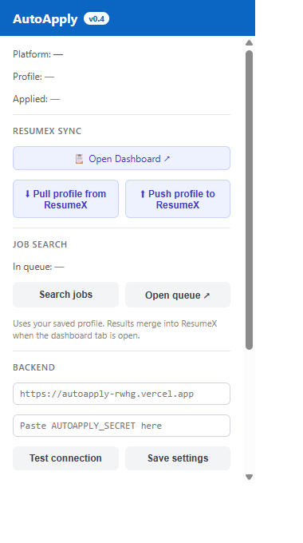
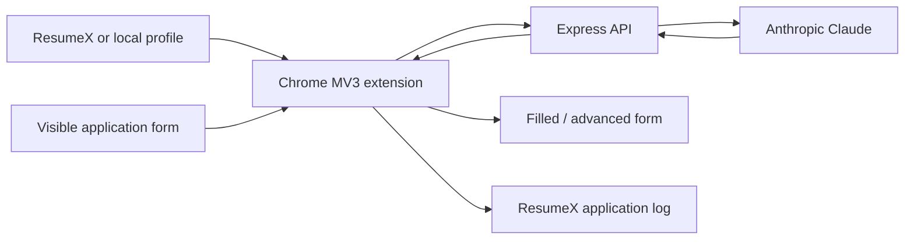

# AutoApply

<p align="center">
  <strong>An experimental Chrome extension for profile-backed job application autofill.</strong><br />
  A Manifest V3 extension captures visible form fields, an Express backend drafts answers with Claude, and ResumeX keeps the reusable profile and application log together.
</p>

<p align="center">
  <a href="https://resumex.talentxrecruiting.com/autoapply"><strong>Open the ResumeX workspace</strong></a>
  ·
  <a href="#local-setup">Run locally</a>
  ·
  <a href="./docs/ECOSYSTEM.md">Ecosystem contract</a>
</p>

<p align="center">
  
  
  
  
</p>

<p align="center">
  
</p>

> [!WARNING]
> AutoApply is experimental. Some platform adapters can advance multi-step flows and click a final submit button after required-field checks. Review your profile and generated answers **before starting automation**, use it only where permitted, and do not rely on it for applications that require legal, accessibility, compensation, or work-authorization judgment.

## How it works



The extension sends the candidate profile, job context, and detected form fields to the configured backend. The backend sends that context to Anthropic and returns a label-to-answer JSON object. Content scripts apply the result to the current page.

## Platform adapters

| Platform | Behavior in this prototype |
| --- | --- |
| LinkedIn Easy Apply | Fills fields, advances steps, checks required fields, and can submit. |
| Indeed | Fills fields, advances steps, checks required fields, and can submit. |
| Workday | Handles a multi-step flow and can submit when a submit control is detected. |
| Greenhouse | Fills the single-page form; the user reviews and submits. |
| Lever | Fills the single-page form; the user reviews and submits. |
| Jobgether | Fills detected fields and records the application flow. |

Job-board DOM structures change frequently. Treat this table as the intended adapter behavior, not a compatibility guarantee.

## Repository layout

```text
extension/                 Chrome Manifest V3 extension
  popup/                   Profile, backend and queue controls
  content/                 Shared helpers and platform adapters
  jobs/                    Local job queue dashboard
backend/                   Express API and Claude integration
  routes/                  Apply, jobs and profile endpoints
  services/                Answer generation, search and matching
  tests/                   Jest + Supertest coverage
shared/hub-contract.js     ResumeX storage and message contract
docs/ECOSYSTEM.md          Cross-project integration notes
resumex-pages/             Standalone ResumeX integration pages
resumex-patches/           Reference integration patches
```

## Local setup

### 1. Start the backend

```bash
git clone https://github.com/VicenteBarrientos/autoapply.git
cd autoapply/backend
npm install
cp .env.example .env
```

On Windows PowerShell:

```powershell
Copy-Item .env.example .env
```

Configure:

```env
ANTHROPIC_API_KEY="replace-with-your-key"
AUTOAPPLY_SECRET="replace-with-a-long-random-value"
# Optional only while rotating clients without downtime:
AUTOAPPLY_SECRET_NEXT=""
PORT=3000
```

Generate the shared secret with a cryptographically secure tool, then store the same value in the extension popup. In production the API fails closed when this secret is missing.

```bash
npm start
```

### 2. Load the extension

1. Open `chrome://extensions`.
2. Enable **Developer mode**.
3. Select **Load unpacked** and choose the repository's `extension/` directory.
4. Open the extension popup.
5. Enter the backend URL and shared secret, then test the connection.
6. Pull a profile from ResumeX or save a local profile.

### 3. Try a supported form

Open a supported job application, inspect the stored profile, and start the injected AutoApply control. Use synthetic data first when developing an adapter.

## Testing

Backend tests mock Anthropic, so they do not make paid model calls:

```bash
cd backend
npm test
```

For local auto-reload:

```bash
npm run dev
```

After editing extension code, reload the unpacked extension from `chrome://extensions` and refresh the target page.

## Security and privacy

- `AUTOAPPLY_SECRET` protects API routes through the `X-Autoapply-Key` header. `AUTOAPPLY_SECRET_NEXT` temporarily admits a second value for zero-downtime rotation; remove it after every client has migrated. Production requests are rejected when neither value is configured.
- Candidate profile data is stored in `chrome.storage.local` and, when an answer is requested, is transmitted to the configured backend **and Anthropic**.
- The API rate limiter reduces accidental request bursts, but a serverless deployment needs a shared/durable store for enforcement across instances.
- Keep `.env`, candidate profiles, seed scripts, injected expressions, and browser exports out of Git.
- Rotate the shared secret immediately if it appears in logs, shell history, screenshots, or an accidentally tracked file.

## Responsible use

Generated answers can be incomplete or wrong. The candidate is responsible for the truth of every application and for compliance with job-board terms. Never fabricate credentials, work authorization, salary history, disability information, demographic information, or professional experience.

## Deployment

See [VERCEL.md](./VERCEL.md) for backend deployment. The current production default in the extension is `https://autoapply-rwhg.vercel.app`; forks should set their own backend URL from the popup.
